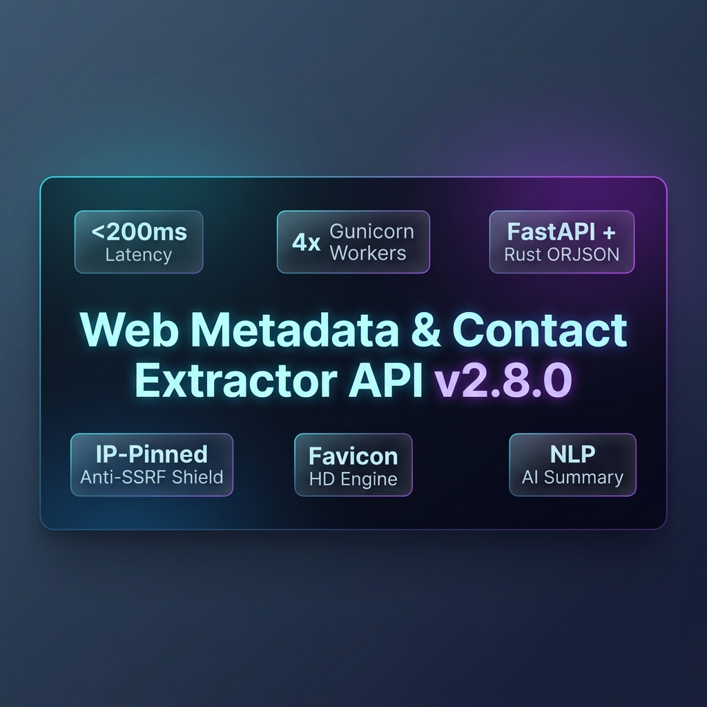

<div align="center">

  

  # 🚀 Web Metadata, OpenGraph & Contact Extractor API

  **Ultra-fast (<200ms) REST API to extract SEO OpenGraph metadata, contact emails, phone numbers, social media profiles, and CMS tech stacks from any URL.**

  [](https://www.python.org/)
  [](https://fastapi.tiangolo.com/)
  [](https://rapidapi.com/)
  []()
  []()
  [](LICENSE)

  [🔑 Get Free API Key on RapidAPI](https://rapidapi.com/) • [📖 API Documentation](#-api-documentation) • [⚡ Code Examples](#-code-examples)

</div>

---

## 🌟 Key Features

- ⚡ **Blazing Fast (<200ms)**: Powered by `selectolax` (C-Lexbor parser), HTTP/2 multiplexing, and 256KB streaming limits.
- 🎯 **SEO & OpenGraph Metadata**: Instantly retrieves Page Title, Meta Description, OG Image, Keywords, Author, Site Name, Language, and Favicon.
- 📧 **Clean Contact Extractor**: Deep extraction of public email addresses and phone numbers. Includes smart DOM cleaning (`<script>` / `<style>` removal) to eliminate false positives.
- 📲 **Social Profile Finder**: Auto-detects profiles on **Twitter/X, LinkedIn, Facebook, Instagram, GitHub, YouTube, Telegram, and TikTok**.
- 🛠️ **Technology Stack Detector**: Recognizes CMS and framework signatures (**WordPress, Shopify, WooCommerce, Wix, Squarespace, React, Next.js, Vue, Nuxt, TailwindCSS, Bootstrap**).
- 🚀 **Built-in 15-Min In-Memory Cache**: Repeated requests serve in **< 0.1 ms** with zero server overhead.

---

## ⚡ Quick Start

### 1. Python Example

```python
import requests

url = "https://web-metadata-and-contact-extractor-p.rapidapi.com/api/v1/extract"
headers = {
    "X-RapidAPI-Key": "YOUR_RAPIDAPI_KEY_HERE",
    "X-RapidAPI-Host": "web-metadata-and-contact-extractor-p.rapidapi.com"
}
params = {"url": "https://github.com"}

response = requests.get(url, headers=headers, params=params)
data = response.json()

print(f"Title: {data['metadata']['title']}")
print(f"Emails: {data['contacts']['emails']}")
print(f"Social Links: {data['social_links']}")
print(f"Execution Time: {data['execution_time_ms']} ms")
```

### 2. JavaScript / Node.js (Fetch) Example

```javascript
const url = 'https://web-metadata-and-contact-extractor-p.rapidapi.com/api/v1/extract?url=https%3A%2F%2Fgithub.com';
const options = {
  method: 'GET',
  headers: {
    'X-RapidAPI-Key': 'YOUR_RAPIDAPI_KEY_HERE',
    'X-RapidAPI-Host': 'web-metadata-and-contact-extractor-p.rapidapi.com'
  }
};

try {
  const response = await fetch(url, options);
  const result = await response.json();
  console.log('Title:', result.metadata.title);
  console.log('Social Links:', result.social_links);
  console.log('Response Time:', result.execution_time_ms, 'ms');
} catch (error) {
  console.error(error);
}
```

### 3. cURL Command

```bash
curl --request GET \
  --url 'https://web-metadata-and-contact-extractor-p.rapidapi.com/api/v1/extract?url=https%3A%2F%2Fgithub.com' \
  --header 'X-RapidAPI-Host: web-metadata-and-contact-extractor-p.rapidapi.com' \
  --header 'X-RapidAPI-Key: YOUR_RAPIDAPI_KEY_HERE'
```

---

## 📊 Sample API Response (JSON)

```json
{
  "url": "https://github.com",
  "status_code": 200,
  "execution_time_ms": 185.42,
  "metadata": {
    "title": "GitHub · Change is constant. GitHub keeps you ahead. · GitHub",
    "description": "Join the world's most widely adopted, AI-powered developer platform...",
    "og_image": "https://github.githubassets.com/assets/campaign-social-04.png",
    "keywords": null,
    "author": null,
    "site_name": "GitHub",
    "language": "en",
    "favicon": "https://github.githubassets.com/favicons/favicon.svg"
  },
  "social_links": {
    "twitter": null,
    "facebook": null,
    "instagram": null,
    "linkedin": null,
    "github": "https://github.com/features/copilot",
    "youtube": null,
    "telegram": null,
    "tiktok": null
  },
  "contacts": {
    "emails": [],
    "phones": []
  },
  "detected_technologies": []
}
```

---

## 📖 API Endpoint Documentation

| Endpoint | Method | Category | Description |
| :--- | :--- | :--- | :--- |
| `/api/v1/extract` | `GET` | **Full Extractor** | Complete extraction payload (SEO metadata, contacts, social links, technologies). |
| `/api/v1/link-preview` | `GET` | **Link Preview** | Lightweight payload optimized for social link previews (Title, OG Image, Favicon, Description). |
| `/api/v1/contacts` | `GET` | **Lead Generation** | Targeted lead extraction (Public Emails, Phone Numbers, Social Profiles). |
| `/api/v1/tech-stack` | `GET` | **Tech Stack** | Framework & CMS detector (WordPress, Shopify, React, Next.js, Tailwind, etc.). |
| `/health` | `GET` | **Health** | Health check returning API status and version. |

### Query Parameters

| Parameter | Type | Required | Description |
| :--- | :--- | :--- | :--- |
| `url` | `string` | **Yes** | The target website URL (e.g. `https://example.com`). |
| `user_agent` | `string` | No | Custom User-Agent header (optional). |


---

## 🔧 Self-Hosting & Local Development

Want to run the API locally or deploy to Render/Fly.io?

```bash
# 1. Clone the repository
git clone https://github.com/JosejuX/rapidapi-metadata-extractor.git
cd rapidapi-metadata-extractor/rapidapi_service

# 2. Install dependencies
pip install -r requirements.txt

# 3. Run test suite
python test_api.py

# 4. Start local dev server
uvicorn main:app --reload --port 8000
```

Open `http://localhost:8000/docs` in your browser for the interactive Swagger UI.

---

## 🏷️ Keywords & Search Topics

`metadata-extractor` • `opengraph-parser` • `email-scraper` • `contact-extractor` • `social-links-finder` • `tech-stack-detector` • `seo-parser` • `fastapi` • `rapidapi` • `python-web-scraper` • `link-preview-generator` • `lead-generation-api`

---

## 📄 License

Distributed under the MIT License. See `LICENSE` for more information.
